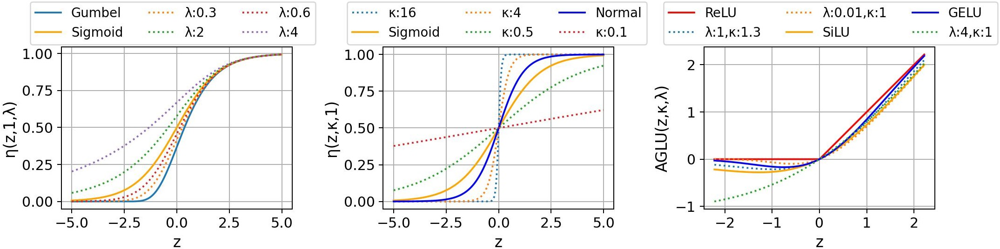
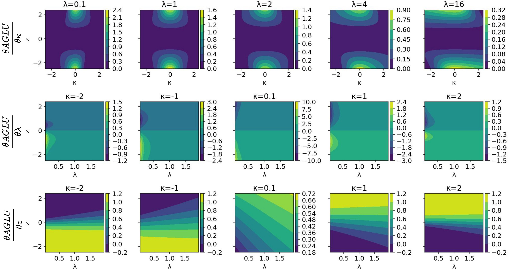

<div align="center">
<h1>Adaptive Parametric Activation </h1>

[Konstantinos Panagiotis Alexandridis](https://kostas1515.github.io/)<sup>1</sup>, 
[Jiankang Deng](https://jiankangdeng.github.io/)<sup>1</sup>, 
[Anh Nguyen](https://cgi.csc.liv.ac.uk/~anguyen/)<sup>2</sup>,
[Shan Luo](https://shanluo.github.io/)<sup>3</sup>,

<sup>1</sup> Huawei Noah's Ark Lab, 
<sup>2</sup> University of Liverpool, 
<sup>3</sup> King's College London

[](https://link.springer.com/chapter/10.1007/978-3-031-72949-2_26)
[](https://arxiv.org/pdf/2407.08567)

[](https://paperswithcode.com/sota/long-tail-learning-on-places-lt?p=adaptive-parametric-activation)
[](https://paperswithcode.com/sota/instance-segmentation-on-lvis-v1-0-val?p=adaptive-parametric-activation)
[](https://paperswithcode.com/sota/long-tail-learning-on-imagenet-lt?p=adaptive-parametric-activation)
[](https://paperswithcode.com/sota/long-tail-learning-on-inaturalist-2018?p=adaptive-parametric-activation)

</div>

This is the official implementation of Adaptive Parametric Activation (APA) for ECCV2024 accepted paper. 

 

 <h3>Abstract</h3>

The activation function plays a crucial role in model optimisation, yet the optimal choice remains unclear. For example, the Sigmoid activation is the de-facto activation in balanced classification tasks, however, in imbalanced classification, it proves inappropriate due to bias towards frequent classes.  In this work, we delve deeper in this phenomenon by performing a comprehensive statistical analysis in the classification and intermediate layers of both balanced and imbalanced networks and we empirically show that aligning the activation function with the data distribution, enhances the performance in both balanced and imbalanced tasks. To this end, we propose the Adaptive Parametric Activation (APA) function, a novel and versatile activation function that unifies most common activation functions under a single formula. APA can be applied in both intermediate layers and attention layers, significantly outperforming the state-of-the-art on several imbalanced benchmarks such as ImageNet-LT, iNaturalist2018, Places-LT, CIFAR100-LT and LVIS and balanced benchmarks such as ImageNet1K, COCO and V3DET.
<h3>Definition</h3>

APA is defined as: $APA(z,λ,κ) = (λ exp(−κz) + 1) ^{\frac{1}{−λ}}$. APA unifies most activation functions under the same formula.

APA can be used insed the intermediate layers using Adaptive Generalised Linear Unit (AGLU): $AGLU(z,λ,κ) = z APA(z,λ,κ)$. The derivatives of AGLU with respect to κ (top), λ (middle) and z (bottom) are shown below:



<h3> Simple Code implementation </h3>

```python
class Unified(nn.Module):
    """Unified activation function module."""

    def __init__(self, device=None, dtype=None) -> None:
        """Initialize the Unified activation function."""
        factory_kwargs = {"device": device, "dtype": dtype}
        super().__init__()
        lambda_param = torch.nn.init.uniform_(torch.empty(1, **factory_kwargs))
        kappa_param = torch.nn.init.uniform_(torch.empty(1, **factory_kwargs))
        self.softplus = nn.Softplus(beta=-1.0)
        self.lambda_param = nn.Parameter(lambda_param)
        self.kappa_param = nn.Parameter(kappa_param)

    def forward(self, input: torch.Tensor) -> torch.Tensor:
        """Compute the forward pass of the Unified activation function."""
        l = torch.clamp(self.lambda_param, min=0.0001)
        p = torch.exp((1 / l) * self.softplus((self.kappa_param * input) - torch.log(l)))
        return p  # for AGLU simply return p*input
```

## Getting Started

- For **Image Classification**, please see the [README.md](classification/README.md) for detailed instructions and model weights.
- For **Object Detection and Instance Segmentation**, please see the [README.md](mmdetection_v3.2/README.md) for detailed instructions and model weights.
     

## BibTeX

```bibtex
@article{alexandridis2024adaptive,
  title={Adaptive Parametric Activation},
  author={Alexandridis, Konstantinos Panagiotis and Deng, Jiankang and Nguyen, Anh and Luo, Shan},
  journal={arXiv preprint arXiv:2407.08567},
  year={2024}
}
```

## Acknowledgements
This code uses <a href='https://pytorch.org/'>Pytorch</a> and the <a href='https://github.com/open-mmlab/mmdetection'>mmdet</a> framework. Thank you for your wonderfull work!

     
